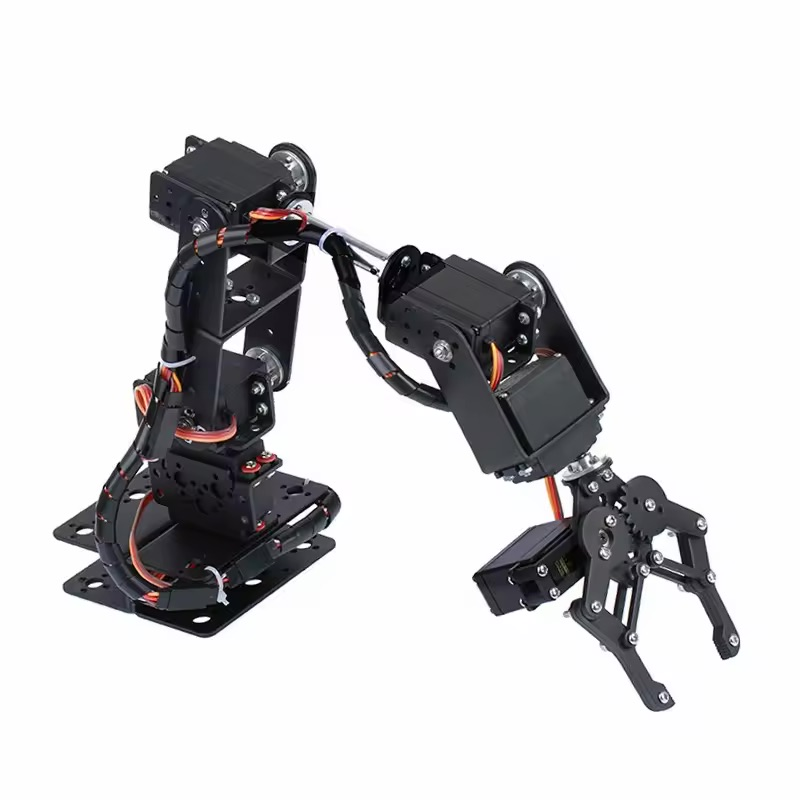
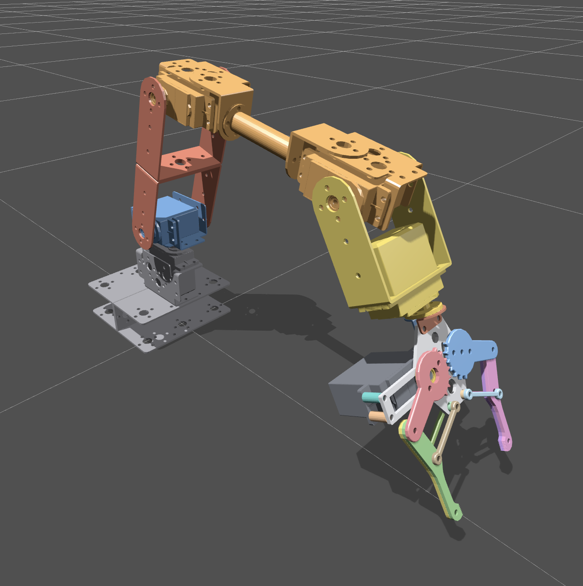

# Aliexpress Robot Arm URDF

URDF file built based on a [cheap Ali Express Robot Arm](https://shorturl.at/5LxBd).

Built assembling the stls files from [this google drive folder](https://drive.google.com/drive/folders/1z7AVxPrJAR7Jzgnl_q90dgB-ZeNmKGLZ) using FreeCAD/OpenSCAD.

assembled robot from aliexpress

urdf viewed in [Robot Viewer](https://viewer.robotsfan.com/)

## Current status

All arm joints move in simulation, and the gripper reaches its full opening range.

## Work in progress

- Compare the simulated joint axes, travel limits, and gripper mounting with measurements from the assembled arm.
- Measure the links' masses, centers of mass, and inertias. The current arm inertia values are provisional, and most gripper links have no inertial properties yet.
- Simplify the collision meshes and check clearances through the arm's motion for collision-aware planning and physics simulation.
- Add measured servo limits and joint dynamics before using the model for hardware control or calibrated physics simulation.
- Document the simulator and validation procedure, and confirm the source STL files' redistribution terms before publishing the meshes.
